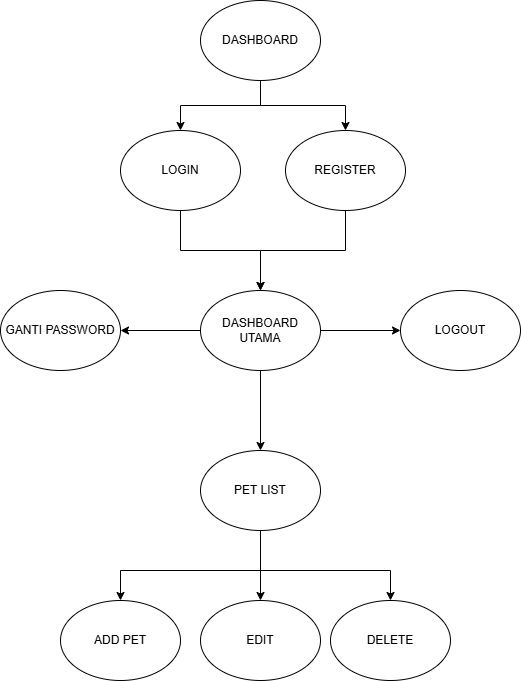

# Nama Aplikasi
Sistem Flask Manajemen Hewan Peliharaan

## Kegunaan Aplikasi
Aplikasi "Manajemen Hewan Peliharaan" ini adalah sebuah aplikasi web yang dirancang untuk mencatat data hewan peliharaan, manajemen pemilik dan mengelola dengan fitur CRUD. dengan tambahan fitur berupa search untuk mencari nama pemilik hewan peliharaan.

## Flowchart
Berikut adalah flowchart yang menggambarkan alur kerja aplikasi:

## Perkenalan Tim
- Rycho Febrian Nalendra Putra - [Mengerjakan app dan init]
- Peniel Manurung - [Mengerjakan templates]
- Irfan Maulana - [Mengerjakan Bagian models dan static sebagian dari template]
- Muzaki Syifauz Z.A - [Mengerjakan Forms dan database]

## Link Video Dokumentasi
Anda dapat menonton video dokumentasi aplikasi melalui tautan berikut: [Klik Disini](https://youtu.be/Jkca1T9_peI)
